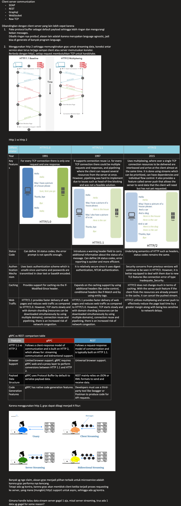

1. grpc common as dependency for grpc-unary
2. grpc common built with proto maven plugin, so we have to put the .proto in directory named proto, so generated file (target) will compile properly
3. spring boot starter 3.0.0 have not working with grpc, so we have to use spring boot 2
4. some version which only work in this project (proto buf version 3.14, grpc server starter 2.13.1.RELEASE) 
5. java_package name same with our package in grpc-unary
6. @GrpcService so we can hit the service, is annotations from grpc starter
7. onNext used to set the response
8. onCompleted used to close the connection

